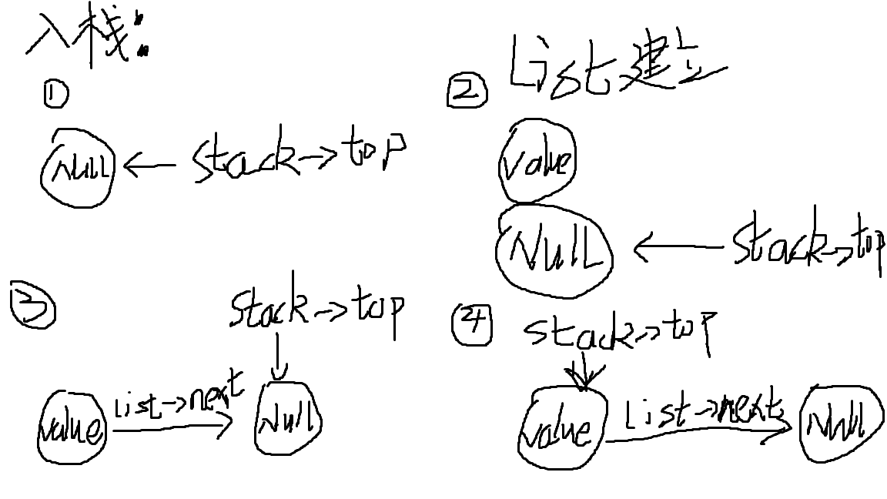
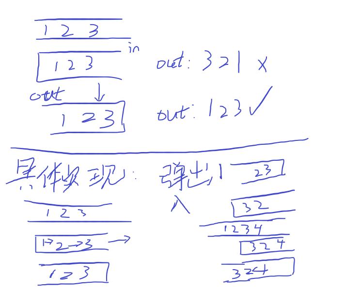

## 前言

这一章是关于栈的，一些和栈有关的知识和用法会保存在这里。

大概率会使用一些链表来构建栈，用数组构建栈更加方便而且容易理解，但是链表是新鲜的

所有我会分两部分来记录，一部分是链表，一部分是数组

**代码不是直接复制就能用了！！！！要更改的！！！！！！**

## 用链表来实现栈

用链表来实现栈，是挺复杂的，但是也有不少优点，可以动态分配内存，占用就少了，内存利用也高，速度也快，甚至可拓展性非常强，每一样都胜过数组，唯一的缺点就是代码书写复杂

用链表来实现栈，可以借数组来理解，链表就是数组部分，数组的遍历通过序号，链表的遍历通过下一节点，唯一有区别的就是，数组的头指针就是当前序号，而链表需要新建一个头指针来指向他，下面是基础代码：

### 基础部分：

#### 栈和链表的定义

```C
struct ListNode {
    int value;
    struct ListNode* next;
}; //这一步是定义链表
```

```C
struct Stack{
    struct ListNode* top;
}; //这一步是定义一个头指针,也就是栈的头指针，指向栈顶
```

既然是一个栈，就会有基础的操作，栈的建立，出栈，入栈，判断栈是否为空，有一些步骤需要**释放内存**的，我在示例代码中就**不添加**了，示例代码:

#### 栈的建立

```C
struct Stack* createStack() {
    struct Stack* stack = (struct Stack*)malloc(sizeof(struct Stack)); //给栈动态分配内存
    stack->top = NULL; //栈顶指向空，初始化定义肯定是空
    return stack;
} //这是建立栈的操作
```

#### 入栈

```C
void push(Stack* stack, int value) {
    struct ListNode* List = (struct ListNode*)malloc(sizeof(struct ListNode)); //给链表分配空间 1
    List->value = value;// 2
    List->next = stack->top;// 3
    stack->top = List;// 4
} //这是入栈的操作，理解稍微难
```

图解：



#### 出栈

```C
int pop(Stack* stack) {
    if(stack->top == NULL) {
        return false;
    }
    int returnValue = stack->top->bracket;
    struct ListNode* release = stack->top; //要释放掉已经弹出的栈
    stack->top = stack->top->next;
    free(release); //释放内存
    return returnValue;
}
```

#### 判断是否为空

```C
int isEmpty(Stack* stack) {
    if(!stack->top) {
        return 1;
    }
    else {
        return 0;
    }
} //输出条件可以随便输出，只要知道stack->top的判断条件就可以了
```

### 题目：

#### 1.[ 有效的括号](https://leetcode.cn/problems/valid-parentheses/)

给定一个只包括 '('，')'，'{'，'}'，'['，']' 的字符串 s ，判断字符串是否有效。

有效字符串需满足：

1. 左括号必须用相同类型的右括号闭合。

2. 左括号必须以正确的顺序闭合。
3. 每个右括号都有一个对应的相同类型的左括号。

**示例1：**

```
输入：s = "()"
输出：true
```

**示例2：**

```
输入：s = "()[]{}"
输出：true
```

**示例3：**

```
输入：s = "(]"
输出：false
```

**提示：**

- `1 <= s.length <= 104`
- `s` 仅由括号 `'()[]{}'` 组成

**代码：**

```C
bool isValid(char * s){
    int len = strlen(s);
    if(len%2 != 0) {
        return false;
    }

	struct Stack* mystack = createStack();

    char bracketMid;
    for(int i=0;i<len;i++) {
        if(s[i]=='(') {
            push(mystack,')');
        }
         if(s[i]=='{') {
            push(mystack,'}');
        }
         if(s[i]=='[') {
            push(mystack,']');
        }
        if(s[i]==')') {
            bracketMid=pop(mystack);
            if(s[i]!=bracketMid) {
                return false;
            }
        }
        if(s[i]=='}') {
            bracketMid=pop(mystack);
            if(s[i]!=bracketMid) {
                return false;
            }
        }
        if(s[i]==']') {
            bracketMid=pop(mystack);
            if(s[i]!=bracketMid) {
                return false;
            }
        }
    }

    int mystackIsEmpyt = isEmpty(mystack);
    if(mystackIsEmpyt == 0) {
        return false;
    }

    return true;

}

int main() {
	char* s = "([]))";
    if (isValid(s)) {
        printf("true");
    } else {
        printf("false\n");
    }
    return 0;
}
```

##### 题目小tip

在C语言中，`malloc()`函数返回一个`void*`类型的指针，它指向动态分配的内存空间的首地址。由于`void*`类型的指针不能直接赋值给其他类型的指针变量，因此通常需要将其强制转换为目标类型的指针。

在使用`malloc()`函数分配内存时，需要指定要分配的内存空间大小，而分配的大小通常与目标类型的大小有关。例如，如果要分配一个`struct Stack`类型的内存空间，可以使用以下代码：

```C
struct Stack* stack = (struct Stack*)malloc(sizeof(struct Stack));
```

其中，`sizeof(struct Stack)`表示`struct Stack`类型所占用的字节数，而`(struct Stack*)`则将返回的`void*`类型指针强制转换为`struct Stack*`类型指针。

在某些情况下，可以省略强制类型转换，例如：

```C
int* p = malloc(sizeof(int));
```

由于`malloc()`返回的指针可以隐式转换为任何类型的指针，因此在这种情况下不需要显式地进行强制类型转换。但是，在某些编译器或编译器设置中，如果省略了强制类型转换可能会导致警告或错误，因此为了避免这种情况，建议始终在调用`malloc()`函数时显式地进行强制类型转换。


## 用数组来实现栈

这个比较方便，不解释，直接上代码

### 基础部分：

#### 栈的定义与建立

直接定义一个数组，和一个整形变量，但是数组的容量一定要多一个，因为有个空栈

```C
int array[n], top=0;//top就是栈顶指针
```

#### 入栈

```C
array[top]=x;top++;
```

#### 出栈

```C
y=array[top];top--;
```

#### 判断是否为空

```C
if(top == 0) {
    if(array[top] == NULL) {
        return true;
    }
}
```

### 题目：

#### 1.[ 有效的括号](https://leetcode.cn/problems/valid-parentheses/)

给定一个只包括 '('，')'，'{'，'}'，'['，']' 的字符串 s ，判断字符串是否有效。

有效字符串需满足：

1. 左括号必须用相同类型的右括号闭合。
2. 左括号必须以正确的顺序闭合。
3. 每个右括号都有一个对应的相同类型的左括号。

**示例1：**

```
输入：s = "()"
输出：true
```

**示例2：**

```
输入：s = "()[]{}"
输出：true
```

**示例3：**

```
输入：s = "(]"
输出：false
```

**提示：**

- `1 <= s.length <= 104`
- `s` 仅由括号 `'()[]{}'` 组成

**代码：**

```c
char pairs(char a) {
    if (a == '}') return '{';
    if (a == ']') return '[';
    if (a == ')') return '(';
    return 0;
}

bool isValid(char* s) {
    int n = strlen(s);
    if (n % 2 == 1) {
        return false;
    }
    int stk[n + 1], top = 0;
    for (int i = 0; i < n; i++) {
        char ch = pairs(s[i]);
        if (ch) {
            if (top == 0 || stk[top - 1] != ch) {
                return false;
            }
            top--;
        } else {
            stk[top++] = s[i];
        }
    }
    return top == 0;
}

```


## 用栈实现队列

栈是先进后出，队列是先进先出，想要实现这个队列的功能，可以创建两个栈，一个输出栈，一个输入栈，把数据先存入输入栈，然后再弹出，存入输出栈，这样就可以完成先进先出，最后再把输出栈的栈顶元素记录然后弹出，最后再把输出栈的内容存入输入栈中，这样可以防止循序被打乱

### 基础部分:



#### 栈的定义与创立

```C
typedef struct {
    int stackInTop, stackOutTop;
    int stackIn[100], stackOut[100];
} MyQueue;
```

```C
MyQueue* myQueueCreate() {
    MyQueue* queue = (MyQueue*)malloc(sizeof(MyQueue));
    queue->stackInTop = 0;
    queue->stackOutTop = 0;
    return queue;
}
```

#### 入栈

```C
void myQueuePush(MyQueue* obj, int x) {
    obj->stackIn[(obj->stackInTop)++] = x;
}
```

#### 出栈

```C
int myQueuePop(MyQueue* obj) {
    //优化：复制栈顶指针，减少对内存的访问次数
    int stackInTop = obj->stackInTop;
    int stackOutTop = obj->stackOutTop;
    //若输出栈为空
    if(stackOutTop == 0) {
        //将第一个栈中元素复制到第二个栈中
        while(stackInTop > 0) {
            obj->stackOut[stackOutTop++] = obj->stackIn[--stackInTop];
        }
    }
    //将第二个栈中栈顶元素（队列的第一个元素）出栈，并保存
    int top = obj->stackOut[--stackOutTop];
    //将输出栈中元素放回输入栈中
    while(stackOutTop > 0) {
        obj->stackIn[stackInTop++] = obj->stackOut[--stackOutTop];
    }
    //更新栈顶指针
    obj->stackInTop = stackInTop;
    obj->stackOutTop = stackOutTop;
    //返回队列中第一个元素
    return top;
}
```

#### 判断是否为空

```C
bool myQueueEmpty(MyQueue* obj) {
    return obj->stackInTop == 0 && obj->stackOutTop == 0;
}
```

#### 获取队列出口处的元素

```C
int myQueuePeek(MyQueue* obj) {
    return obj->stackIn[0];
}
```

这个有点多余的。。。

#### 栈顶置零

```C
void myQueueFree(MyQueue* obj) {
    obj->stackInTop = 0;
    obj->stackOutTop = 0;
}
```

### 题目：

#### 1.[用栈实现队列](https://leetcode.cn/problems/implement-queue-using-stacks/)

请你仅使用两个栈实现先入先出队列。队列应当支持一般队列支持的所有操作（push、pop、peek、empty）：

实现 MyQueue 类：

- void push(int x) 将元素 x 推到队列的末尾

- int pop() 从队列的开头移除并返回元素
- int peek() 返回队列开头的元素
- boolean empty() 如果队列为空，返回 true ；否则，返回 false

说明：

- 你 只能 使用标准的栈操作 —— 也就是只有 push to top, peek/pop from top, size, 和 is empty 操作是合法的。
- 你所使用的语言也许不支持栈。你可以使用 list 或者 deque（双端队列）来模拟一个栈，只要是标准的栈操作即可。

**示例1：**

```
输入：
["MyQueue", "push", "push", "peek", "pop", "empty"]
[[], [1], [2], [], [], []]
输出：
[null, null, null, 1, 1, false]

解释：
MyQueue myQueue = new MyQueue();
myQueue.push(1); // queue is: [1]
myQueue.push(2); // queue is: [1, 2] (leftmost is front of the queue)
myQueue.peek(); // return 1
myQueue.pop(); // return 1, queue is [2]
myQueue.empty(); // return false
```

**提示：**

- 1 <= x <= 9
- 最多调用 100 次 push、pop、peek 和 empty
- 假设所有操作都是有效的 （例如，一个空的队列不会调用 pop 或者 peek 操作）

**这个就不放代码了，代码几乎就是基础部分**
